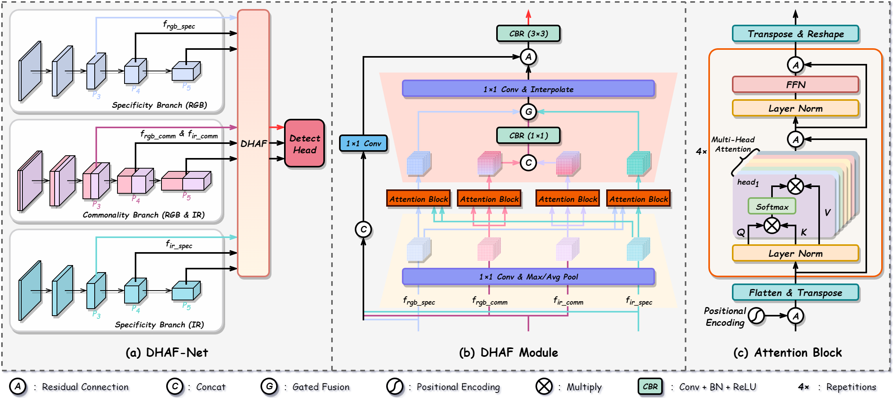

# DHAF-Net

Official PyTorch implementation of “DHAF-Net: Decoupled and Hierarchical Attention Fusion Network for RGB-Infrared Object Detection”

[Paper]()

🔒 The core implementation folder **`ultralytics/`** will be released after the paper is accepted.

## Abstract

The fusion of visible (RGB) and infrared (IR) images is a pivotal technology for robust object detection under all-weather, around-the-clock conditions. However, existing multi-modal fusion methods often suffer from challenges such as modality imbalance, information redundancy, interference, and the suppression of modality-specific information. To address these challenges, we propose a novel Decoupled and Hierarchical Attention Fusion Network (DHAF-Net), which introduces a new paradigm for multi-modal feature fusion. Architecturally, DHAF-Net explicitly decouples cross-modal features into two components: modality-specific and modality-common information, enabling a more effective preservation and utilization of complementary information from each modality. To implement this, DHAF-Net employs multiple feature streams to capture RGB-specific, IR-specific, and common information, which are then enhanced and fused at multiple scales. This is accomplished through our proposed Decoupled and Hierarchical Attention Fusion (DHAF) module, which integrates two key components: the Differentiated Attention Mechanism (DAM) and the lightweight Adaptive Co-Gated Fusion (ACGF) module. Specifically, the DAM utilizes self-attention to enhance modality-specific features and cross-attention to promote the alignment and interaction of common information. The ACGF performs adaptive weighting across local and global scales to dynamically balance the contributions of features from each modality, thereby mitigating the modal imbalance problem. Experimental results on public datasets such as LLVIP and M3FD demonstrate that DHAF-Net significantly outperforms existing methods, achieving state-of-the-art performance. These results validate the effectiveness of our proposed decoupling and hierarchical fusion strategy and establish a new performance benchmark for multi-modal object detection.

## Overview



## Environment Setup

**1. Create a virtual environment**

```bash
conda create -n dhaf python=3.8
conda activate dhaf
```

**2. Install PyTorch**

```bash
conda install pytorch==2.3.1 torchvision==0.18.1 torchaudio==2.3.1 pytorch-cuda=12.1 -c pytorch -c nvidia
```

**3. Install YOLOv8 dependencies**

Copy the ultralytics folder and the pyproject.toml file to your project root directory, then run:

```bash
pip install -e .
```

## Code Modifications

DHAF-Net is implemented based on the Ultralytics YOLOv8 framework with the following modifications:

- Data loading
	- ultralytics.data.base.BaseDataset.get_image_and_label
	- ultralytics.data.utils.img2label_paths
- Model initialization
	- ultralytics.nn.tasks.DetectionModel.\_\_init\_\_
- Custom modules
	- ultralytics/nn/modules/conv.py
	- ultralytics/nn/modules/block.py
- Others…


## Dataset & Weights

Please convert datasets to YOLO format and organize them as follows:

```
FLIR-aligned / LLVIP / M3FD / ...
    │
    ├─imageIR
    │    ├─test
    │    └─train
    ├─imageRGB
    │    ├─test
    │    └─train
    └─labels
         ├─test
         ├─train
         └─classes.txxt
```

⭐ **Dataset & weights download link:** 

- [Baidu drive](https://pan.baidu.com/s/1LgY7_Xs86yyOJX_olyyikg?pwd=dhaf)
- [Google drive](https://drive.google.com/drive/folders/1kYFKWIeLFmQTXxxvmQhWh8aIjWEup8G5)

## Training

To start training:

```bash
python train.py
```

You can modify training configurations (dataset path, model architecture, hyperparameters) in the YAML or configuration files.

**Evaluation & Prediction**

```
python validate.py
python predict.py
```

## Results

Please refer to the **`./runs/detect/`** directory for training results.

<table border="1" cellpadding="5" cellspacing="0" style="text-align: center;">
    <thead>
        <tr>
            <th rowspan="2">Methods</th>
            <th rowspan="2">Pub.</th>
            <th rowspan="2">Modality</th>
            <th rowspan="2">Backbone</th>
            <th colspan="3">FLIR-Aligned</th>
            <th colspan="3">LLVIP</th>
        </tr>
        <tr>
            <th>AP50</th>
            <th>AP75</th>
            <th>mAP</th>
            <th>AP50</th>
            <th>AP75</th>
            <th>mAP</th>
        </tr>
    </thead>
    <tbody>
        <!-- 示例数据行 - 您可以根据需要添加更多行 -->
        <tr>
            <td>Faster R-CNN</td>
            <td>TPAMI'15</td>
            <td>IR</td>
            <td>ResNet50</td>
            <td>73.4</td>
            <td>34.2</td>
            <td>37.9</td>
            <td>92.6</td>
            <td>48.8</td>
            <td>50.7</td>
        </tr>
        <tr>
            <td>YOLOv5</td>
            <td>20</td>
            <td>IR</td>
            <td>CSPDarknet53v5</td>
            <td>73.9</td>
            <td>35.7</td>
            <td>39.5</td>
            <td>94.6</td>
            <td>72.2</td>
            <td>61.9</td>
        </tr>
        <tr>
            <td>YOLOv8</td>
            <td>23</td>
            <td>IR</td>
            <td>CSPDarknet53v8</td>
            <td>72.9</td>
            <td>34.8</td>
            <td>38.3</td>
            <td>95.2</td>
            <td>72.5</td>
            <td>62.1</td>
        </tr>
        <tr>
            <td>Faster R-CNN</td>
            <td>TPAMI'15</td>
            <td>RGB</td>
            <td>ResNet50</td>
            <td>65.0</td>
            <td>22.8</td>
            <td>30.2</td>
            <td>88.8</td>
            <td>45.7</td>
            <td>47.5</td>
        </tr>
        <tr>
            <td>YOLOv5</td>
            <td>20</td>
            <td>RGB</td>
            <td>CSPDarknet53v5</td>
            <td>67.8</td>
            <td>25.9</td>
            <td>31.8</td>
            <td>90.8</td>
            <td>51.9</td>
            <td>50.0</td>
        </tr>
        <tr>
            <td>YOLOv8</td>
            <td>23</td>
            <td>RGB</td>
            <td>CSPDarknet53v8</td>
            <td>66.3</td>
            <td>25.0</td>
            <td>28.2</td>
            <td>91.9</td>
            <td>53.0</td>
            <td>54.0</td>
        </tr>
        <tr>
            <td>GAFF <a>[29]</a></td>
            <td>WACV'21</td>
            <td>IR+RGB</td>
            <td>Resnet18</td>
            <td>72.9</td>
            <td>32.9</td>
            <td>37.5</td>
            <td>94.0</td>
            <td>60.2</td>
            <td>55.8</td>
        </tr>
        <tr>
            <td>ProbEn <a>[30]</a></td>
            <td>ECCV'22</td>
            <td>IR+RGB</td>
            <td>Resnet50</td>
            <td>75.5</td>
            <td>31.8</td>
            <td>37.9</td>
            <td>93.4</td>
            <td>50.2</td>
            <td>51.5</td>
        </tr>
        <tr>
            <td>CSAA <a>[31]</a></td>
            <td>CVPR'23</td>
            <td>IR+RGB</td>
            <td>Resnet50</td>
            <td>79.2</td>
            <td>37.4</td>
            <td>41.3</td>
            <td>94.3</td>
            <td>66.6</td>
            <td>59.2</td>
        </tr>
        <tr>
            <td>CrossFormer <a>[32]</a></td>
            <td>PRL'24</td>
            <td>IR+RGB</td>
            <td>Resnet50</td>
            <td>79.3</td>
            <td>38.5</td>
            <td>42.1</td>
            <td>97.4</td>
            <td>75.4</td>
            <td>65.1</td>
        </tr>
        <tr>
            <td>RSDet <a>[33]</a></td>
            <td>arXiv'24</td>
            <td>IR+RGB</td>
            <td>Resnet50</td>
            <td>83.9</td>
            <td>40.1</td>
            <td>43.8</td>
            <td>95.8</td>
            <td>70.4</td>
            <td>61.3</td>
        </tr>
        <tr>
            <td>Fusion-DETR <a>[34]</a></td>
            <td>25</td>
            <td>IR+RGB</td>
            <td>Resnet101</td>
            <td>81.5</td>
            <td>-</td>
            <td>44.3</td>
            <td>96.4</td>
            <td>-</td>
            <td>64.6</td>
        </tr>
        <tr>
            <td>CFT <a>[35]</a></td>
            <td>ArXiv'21</td>
            <td>IR+RGB</td>
            <td>CSPDarknet53v5</td>
            <td>78.7</td>
            <td>35.5</td>
            <td>40.2</td>
            <td>97.5</td>
            <td>72.9</td>
            <td>63.6</td>
        </tr>
        <tr>
            <td>YOLO-MS <a>[36]</a></td>
            <td>TCDS'23</td>
            <td>IR+RGB</td>
            <td>CSPDarknet53v5</td>
            <td>75.2</td>
            <td>-</td>
            <td>38.3</td>
            <td>94.9</td>
            <td>-</td>
            <td>60.2</td>
        </tr>
        <tr>
            <td>ICAFusion <a>[37]</a></td>
            <td>PR'24</td>
            <td>IR+RGB</td>
            <td>CSPDarknet53v5</td>
            <td>79.2</td>
            <td>36.9</td>
            <td>41.4</td>
            <td>95.2</td>
            <td>-</td>
            <td>60.1</td>
        </tr>
        <tr>
            <td>LRAF-Net <a>[38]</a></td>
            <td>TNNLS'24</td>
            <td>IR+RGB</td>
            <td>CSPDarknet53v5</td>
            <td>80.5</td>
            <td>-</td>
            <td>42.8</td>
            <td>97.9</td>
            <td>-</td>
            <td>66.3</td>
        </tr>
        <tr>
            <td rowspan="2">Fusion-Mamba <a>[39]</a></td>
            <td rowspan="2">TMM'25</td>
            <td rowspan="2">IR+RGB</td>
            <td>CSPDarknet53v5</td>
            <td>84.3</td>
            <td>-</td>
            <td>44.4</td>
            <td>96.8</td>
            <td>-</td>
            <td>62.8</td>
        </tr>
        <tr>
            <td>CSPDarknet53v8</td>
            <td>84.9</td>
            <td>45.9</td>
            <td>47.0</td>
            <td>97.0</td>
            <td>72.2</td>
            <td>64.3</td>
        </tr>
        <tr>
            <td>DHAF-Net (ours)</td>
            <td>-</td>
            <td>IR+RGB</td>
            <td>CSPDarknet53v8</td>
            <td>82.1</td>
            <td>48.5</td>
            <td>48.1</td>
            <td>97.7</td>
            <td>75.7</td>
            <td>67.4</td>
        </tr>
        <!-- 可以继续添加更多行 -->
    </tbody>
</table>

---

## Citation

If you find this work useful in your research, please consider citing our paper:

```

```

## Acknowledgements

This project is built upon the excellent [Ultralytics YOLOv8](https://github.com/ultralytics/ultralytics) framework. We gratefully acknowledge their open-source contributions.